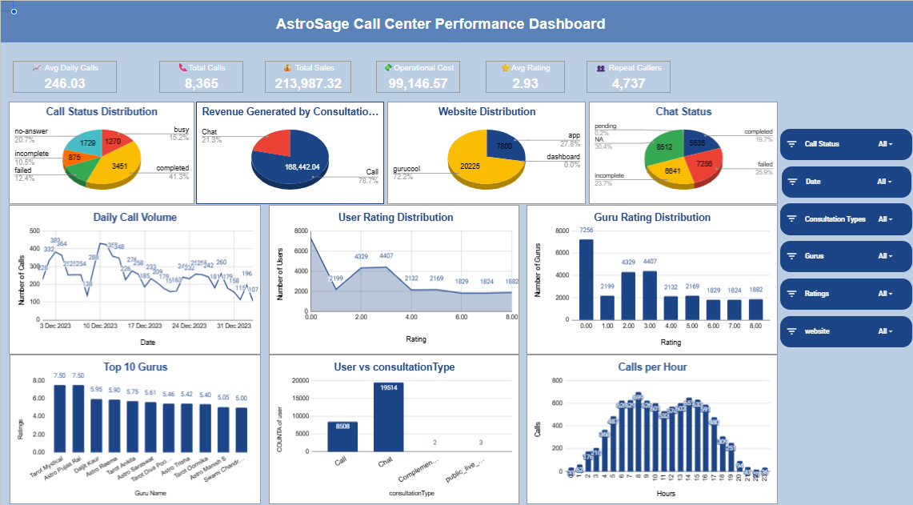

# AstroSage-Data-Analysis-Excel

## Project Overview

AstroSage Call Center Performance Analysis is a business intelligence project focused on analysing customer interactions, revenue, operational costs, customer satisfaction, consultant performance, and workforce utilization.

The project analyses 28,027 customer interaction records across 35+ business attributes and transforms raw operational data into actionable insights using Microsoft Excel, Pivot Tables, formulas, data cleaning, visualizations, and an interactive dashboard.

The objective was to understand operational performance, identify service-quality gaps, evaluate revenue and workload patterns, and provide data-driven recommendations for improving customer experience and operational efficiency.

## Business Problem

AstroSage's consultation operation generates a large volume of customer interactions across call and chat channels.

The business needs to understand:
• When customer demand is highest
• Which consultation types generate the most revenue
• Where operational bottlenecks occur
• How customer satisfaction varies over time and across consultants
• How consultant workloads are distributed
• Whether interaction duration is related to customer satisfaction
• Where training, workforce planning, and technology investments could have the greatest impact

This project uses historical interaction data to answer these questions and convert the findings into practical business recommendations.

## Project Highlights

Total Customer Interactions: 28,027
Total Sales: ₹214,065.90
Total Operational Cost: ₹99,146.57
Average Daily Call Volume: 246.03
Overall Average Rating: 2.93
Peak Interaction Hour: 8:00 AM
Peak-Hour Interactions: 699
Call Revenue: ₹168,520.62
Chat Revenue: ₹45,494.68
Duration-Rating Correlation: 0.0548

## Project Objectives

• Measure daily and monthly customer interaction volume
• Identify high-demand periods
• Analyse operational costs
• Evaluate revenue by consultation type
• Measure customer satisfaction trends
• Compare consultant performance
• Analyse consultant workload distribution
• Understand repeat-customer behaviour
• Analyse interaction duration versus customer rating
• Evaluate call and chat interaction statuses
• Build an interactive Excel dashboard
• Translate analytical findings into business recommendations

## Dataset

The dataset contains 28,027 customer interaction records and 35+ business attributes related to customer interactions, consultants/gurus, consultation types, revenue, operational costs, customer ratings, call and chat status, interaction duration, time-based activity, user and consultant identifiers, and website/platform information.

Important fields include:
• Customer: user, uid
• Consultant: guru, guruName, gid
• Consultation: consultationType, website
• Time: createdAT, chatStartTime, chatEndTime
• Duration: timeDuration, astrologerOnCallDuration, userOnCallDuration
• Revenue: amount, netAmount
• Consultant Earnings: astrologersEarnings
• Status: callStatus, chatStatus
• Customer Experience: rating
• Other Attributes: region, callChannel, callIvrType, queue

The available data covers December 1, 2023 through January 3, 2024.

Note: January contains only a short portion of the available reporting period, so month-to-month comparisons should be interpreted carefully.

## Data Cleaning & Preparation

Before performing the analysis, the raw data was prepared in a dedicated Cleaned Data worksheet.

The cleaning process included:
• Checking for duplicate records
• Removing duplicate rows where applicable
• Handling missing values
• Replacing missing numerical values with 0 where appropriate
• Replacing missing region values with Unknown
• Retaining conditionally missing fields where they were not applicable to certain consultation types
• Removing extra whitespace from text fields
• Standardizing inconsistent consultant/guru names
• Converting date and numerical fields to appropriate data types
• Validating Boolean fields
• Creating additional date, month, hour, and year-month fields for analysis

The cleaned dataset was then used for the analytical worksheets and dashboard.

## Tools & Technologies

Microsoft Excel was used for:
• Pivot Tables
• Excel formulas
• Data cleaning
• Data aggregation
• Data segmentation
• KPI calculations
• Charts
• Interactive dashboard
• Slicers

## Spreadsheet functions included:
SUM(), AVERAGE(), COUNT(), COUNTA(), COUNTUNIQUE(), FILTER(), SORT(), CORREL()

Visualizations included:
• Column Charts
• Line Charts
• Pie Charts
• Horizontal Bar Charts
• Combination Charts
• KPI Cards
• Interactive Slicers

## Analysis Workflow

Raw Data → Data Cleaning & Validation → Feature Preparation → Pivot Table Analysis → KPI Calculation → Trend & Performance Analysis → Data Visualization → Interactive Dashboard → Business Insights → Strategic Recommendations

## Analysis & Key Findings

1. Daily & Monthly Interaction Analysis

Daily interaction analysis showed fluctuations in customer activity, with an average daily call volume of 246.03 calls per day.

Monthly analysis:
• December 2023: 7,947 call interactions
• January 2024: 418 call interactions

December recorded the highest call volume in the available monthly analysis. The large difference should be interpreted carefully because January represents only a short reporting period.

2. Revenue Analysis

Total recorded sales: ₹214,065.90

Revenue by consultation type:
• Call: ₹168,520.62
• Chat: ₹45,494.68
• Public Live Call: ₹50.60
• Complementary: ₹0.00

Call consultations generated approximately 78.72% of total revenue, making them the primary revenue contributor during the analysed period. Chat consultations contributed approximately 21.25%.

3. Operational Cost Analysis

Total operational cost: ₹99,146.57.

December 2023 recorded an operational cost of ₹93,786.16. This analysis helps connect workload levels with associated consultant-related operational costs.

4. Peak-Hour Analysis

8:00 AM recorded the highest interaction volume with 699 interactions.

Customer demand was concentrated broadly between 6 AM and 4 PM, while interaction volumes declined substantially during later evening hours.

5. Customer Satisfaction Analysis

Overall average customer rating: 2.93.

December 2023: 2.95
January 2024: 2.68
Overall: 2.93

The average rating decreased by 0.27 points between December and January. Because January represents a short reporting period, this difference should not automatically be treated as a long-term decline.

6. Consultant Performance Analysis

Consultant-level analysis showed noticeable variation in customer ratings and interaction volumes. The project included Top 10 and Bottom 10 consultant analyses.

These comparisons can be used to identify high-performing consultants, identify consultants requiring additional support, study successful service practices, develop targeted training programs, and improve consistency in customer experience.

7. Consultant Workload Analysis

Examples from the workload analysis:
• Astro Divya: 1,056 interactions
• Astro Dr. Balkrishna: 967 interactions
• Astro Ashok: 619 interactions
• Astro Chandan: 240 interactions

The analysis indicates substantial variation in consultant workloads, creating opportunities to improve workforce allocation, scheduling, consultant utilization, peak-hour coverage, and workload balancing.

8. Call & Chat Status Analysis

The project analysed completed, failed, incomplete, busy, and no-answer call interactions, along with completed, failed, and incomplete chat interactions.

The number of unsuccessful interactions indicates opportunities to investigate operational bottlenecks and improve call handling, agent availability, workforce planning, customer response processes, and operational monitoring.

9. Customer Rating Distribution

Rating 0 was the most frequently recorded rating category, with 7,256 interactions.

Ratings 2 and 3 together accounted for 8,736 interactions.

This indicates an opportunity to investigate the causes of low and moderate customer ratings and identify ways to improve service quality.

10. Interaction Duration vs Customer Satisfaction

Pearson correlation between interaction duration and customer rating: 0.0548.

This represents a very weak positive linear relationship. Therefore, longer interactions alone do not provide strong evidence of higher customer satisfaction.

Some longer-duration groups showed higher average ratings, but this should be treated as an observed pattern rather than evidence that longer consultations directly cause higher satisfaction.

## Interactive Dashboard

The project includes an interactive AstroSage Call Center Performance Dashboard.

Dashboard KPIs:
• Total Customer Interactions
• Total Sales
• Operational Cost
• Average Rating
• Repeat-Customer Analysis
• Average Daily Calls

Dashboard visualizations:
• Daily Call Volume
• Monthly Call Volume
• Revenue by Consultation Type
• Customer Rating Distribution
• Consultant Rating Performance
• Call Status Distribution
• Website/Platform Distribution
• Customer Satisfaction Trends

Interactive filters:
• Date
• Consultation Type
• Consultant/Guru
• Rating
• Website/Platform

The dashboard allows users to explore operational and customer-performance metrics across different dimensions.

## Key Business Insights

• Call consultations are the primary revenue driver, contributing approximately 78.72% of total recorded revenue.
• Customer demand is concentrated during specific hours, with the highest hourly interaction volume of 699 at 8 AM and strong demand generally occurring between 6 AM and 4 PM.
• The overall average customer rating of 2.93 indicates an opportunity to improve customer experience.
• Consultant performance and workload vary significantly, creating opportunities for targeted coaching, performance benchmarking, best-practice sharing, and workload balancing.
• Failed, incomplete, busy, and no-answer interactions indicate potential operational improvement areas.
• The duration-rating correlation of 0.0548 indicates that interaction duration alone is not a strong linear explanation for customer satisfaction.

## Business Recommendations

Workforce Optimization
• Align consultant schedules with historical demand patterns.
• Increase coverage during peak periods.
• Monitor consultant-level workloads.
• Use historical interaction trends for workforce planning.

Customer Satisfaction
• Investigate low-rated interactions.
• Identify service practices used by highly rated consultants.
• Provide targeted coaching and training.
• Track customer satisfaction continuously.

Interaction Success
• Monitor failed, incomplete, busy, and no-answer interactions.
• Identify operational causes behind unsuccessful interactions.
• Improve call and chat handling processes.
• Monitor performance during peak demand periods.

Technology Opportunities
• AI-powered chatbots for initial customer queries
• Automatic Call Distribution
• Workforce Management systems
• CRM integration
• Speech and sentiment analytics
• Real-time KPI dashboards
• Automated quality monitoring

Technology adoption should be based on measurable operational requirements rather than technology adoption alone.

## Proposed ₹1 Crore Investment Allocation

Technology Upgrades: ₹35 Lakhs
Agent Training & Quality Improvement: ₹30 Lakhs
Hiring & Workforce Expansion: ₹20 Lakhs
Customer Experience Enhancement: ₹10 Lakhs
Data Analytics & Dashboard Automation: ₹5 Lakhs
Total: ₹1 Crore

The proposed allocation prioritizes technology, training, workforce capacity, customer experience, and analytics. Hiring should be validated against future workload and capacity requirements.

## Key Takeaways

• Analysed 28,027 customer interaction records across 35+ business attributes.
• Performed data cleaning and preparation before analysis.
• Used Pivot Tables and spreadsheet functions to generate operational and business KPIs.
• Identified 8 AM as the peak interaction hour with 699 interactions.
• Identified 6 AM to 4 PM as the major demand period.
• Found that call consultations contributed approximately 78.72% of total revenue.
• Identified significant differences in consultant workloads.
• Found an overall average customer rating of 2.93.
• Identified failed and incomplete interactions as important areas for operational improvement.
• Found a very weak 0.0548 correlation between interaction duration and customer rating.
• Built an interactive Excel dashboard for monitoring volume, revenue, satisfaction, consultant performance, and operational metrics.
• Converted analytical findings into recommendations for workforce planning, training, customer experience, and technology investment.

## Project Structure

AstroSage-Call-Center-Analysis/
│
├── README.md
│
├── data/
│   └── AstroSage Dataset.xlsx
│
├── analysis/
│   └── Final Submission Excel(Astrosage).xlsx
│
├── presentation/
│   └── PPT(ASTROSAGE).pptx
│
└── documentation/
    └── Final-Doc-submission(Astrosage).docx

## How to Explore the Project

1. Clone or download the repository.
2. Open the Excel workbook.
3. Start with the Dashboard worksheet.
4. Review the Cleaned Data worksheet to understand the data preparation process.
5. Explore the objective analysis worksheets to understand the calculations.
6. Review the Pivot Tables and charts used for analysis.
7. Use the dashboard slicers to filter the data by different dimensions.
8. Review the business insights and recommendations in this README.

## Skills Demonstrated

• Data Cleaning
• Data Preparation
• Exploratory Data Analysis
• Business Intelligence
• KPI Development
• Pivot Table Analysis
• Revenue Analysis
• Operational Cost Analysis
• Customer Satisfaction Analysis
• Workforce Analysis
• Consultant Performance Analysis
• Trend Analysis
• Correlation Analysis
• Data Visualization
• Dashboard Development
• Business Analysis
• Data-Driven Decision Making
• Business Recommendation

Author:
Anjali Kapse
Data Analytics Project
